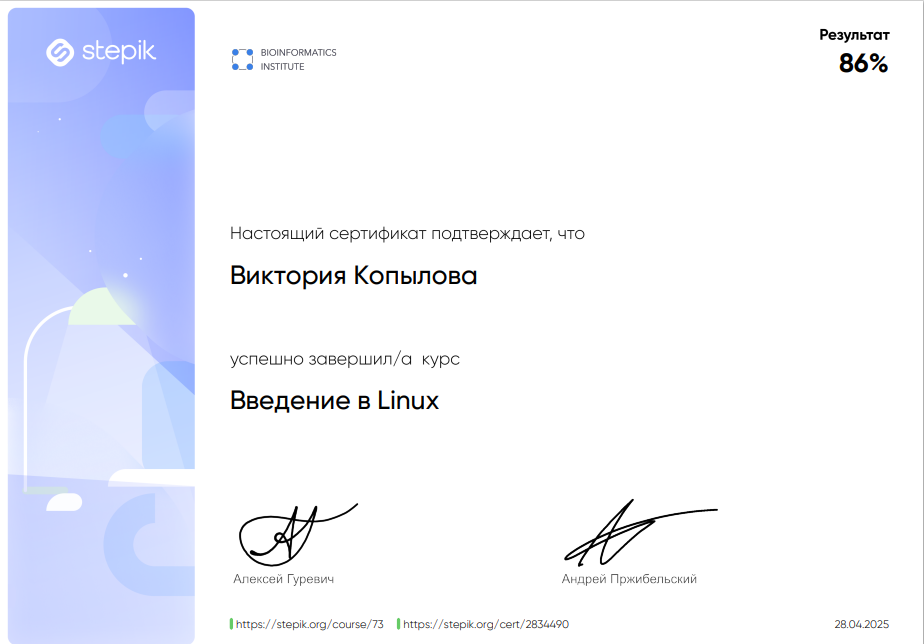

# 📘 Мой путь через курс "Введение в Linux"

Я с удовольствием прошла курс **"Введение в Linux"**, который открыл для меня совершенно новый взгляд на работу с операционными системами. До этого момента я пользовалась исключительно графическими интерфейсами Windows и Mac OS, поэтому командная строка казалась чем-то сложным и непонятным. Но шаг за шагом я открывала для себя мощь и гибкость Linux.

## 🚀 С чего всё началось

Первый шаг — это **установка Linux**. Курс помог мне разобраться в этом процессе, даже несмотря на то, что физически устанавливать систему на компьютер не потребовалось — мы учились в виртуальной среде.

## 🖥️ Графический интерфейс

Оказалось, что **графическая оболочка Linux** не так уж и отличается от привычных операционных систем. Я легко адаптировалась, научилась управлять окнами, запускать программы и настраивать окружение под себя.

## 💻 Командная строка

Этот этап показался мне поначалу непростым. Однако по мере выполнения заданий я осознала, насколько **терминал удобен и эффективен**. Я научилась:

- ориентироваться в файловой системе;
- запускать программы;
- управлять файлами и папками;
- использовать базовые команды `ls`, `cd`, `cp`, `mv`, `grep`, `cat` и другие.

## 🌐 Работа на удалённом сервере

Один из самых интересных этапов — **подключение к удалённому серверу**. Я освоила:

- подключение через `ssh`;
- удалённый запуск программ;
- копирование результатов обратно на локальный компьютер с помощью `scp`.

## 🧠 Продвинутые темы

Финальная часть курса была особенно насыщенной. Я изучила:

- **основы bash-скриптинга** — теперь могу писать простые автоматизированные сценарии;
- **редактор vim** — сперва он показался запутанным, но я освоила базовые команды и поняла его мощь;
- другие полезные инструменты и команды.

## 🎓 Сертификат

Я успешно завершила курс и получила сертификат:

🔗 [Посмотреть сертификат на Stepik](https://stepik.org/cert/2834490)

---

Рекомендую этот курс всем, кто хочет начать свой путь в Linux. Он даёт прочную базу и вдохновляет на дальнейшее изучение.

